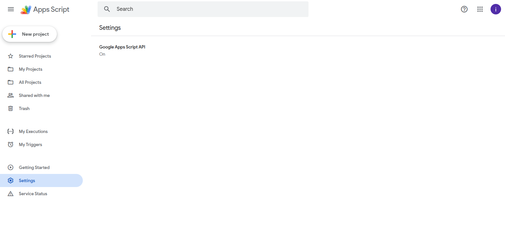

# GAS Clasp Template

This is a template for creating Google Apps Script projects using Clasp (Command-Line Apps Script Projects).

## Prerequisites

- Node.js (version 4.7.4 or later): [Download here](https://nodejs.org/en/download/)
- Google Account with Apps Script enabled

## Setup Steps

### 1. Install Clasp
```bash
npm install -g @google/clasp
```

### 2. Authenticate with Google
```bash
clasp login
```
- This opens your browser for OAuth authentication. Sign in and grant permissions.

### 3. Enable Apps Script API
- **Important**: This must be done before creating the project.
- Visit [https://script.google.com/home/usersettings](https://script.google.com/home/usersettings)
- Enable the Google Apps Script API. Wait a few minutes for it to propagate.



### 4. Create a New Apps Script Project
```bash
clasp create --title "Sample Script"
```
- This creates a new standalone script on Google Drive and generates:
  - `.clasp.json` (stores the script ID)
  - `appsscript.json` (project manifest)

### 5. Add Sample Code
- Create `Code.gs` with a sample function:
```javascript
function myFunction() {
  Logger.log('Hello, World! This is a sample Apps Script function.');
  return 'Sample output';
}

// Function to set up a time-driven trigger (run this once to schedule myFunction)
function createTrigger() {
  ScriptApp.newTrigger('myFunction')
    .timeBased()
    .everyHours(1)  // Runs every hour; customize as needed
    .create();
}
```

### 6. Update Manifest for API Execution
- Edit `appsscript.json` to add:
```json
{
  "timeZone": "America/New_York",
  "dependencies": {},
  "exceptionLogging": "STACKDRIVER",
  "runtimeVersion": "V8",
  "executionApi": {
    "access": "MYSELF"
  }
}
```

### 7. Push Changes to Google Drive
```bash
clasp push
```
- If prompted to overwrite, use `clasp push --force`.

### 8. Open the Script in Editor
```bash
clasp open-script
```
- This opens the Apps Script IDE in your browser.

### 9. Set Up the Trigger
- In the Apps Script editor, run `createTrigger` once (select it and click "Run").
- Grant permissions if prompted.
- Verify the trigger in **Triggers** (clock icon).

## Usage

- **Edit Locally**: Modify `.gs` files, then `clasp push` to sync.
- **Pull Changes**: `clasp pull` to download from Google Drive.
- **Run Functions**: `clasp run <functionName>` (requires API deployment).
- **View Logs**: `clasp logs` or check in the editor.
- **Deploy**: `clasp version "Description"` then `clasp deploy`.

## Notes

- The sample `myFunction` runs every hour via the trigger.
- Customize the trigger interval in `createTrigger` (e.g., `.everyMinutes(30)`).
- For more details, see the [Clasp documentation](https://developers.google.com/apps-script/guides/clasp).